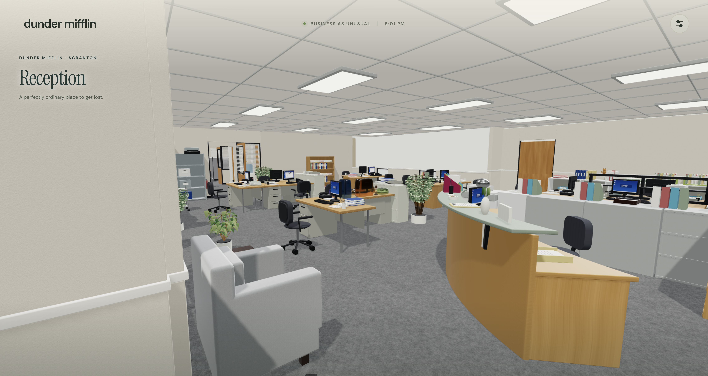

# TheOffice

A walkable Three.js fan recreation of the Scranton office, with interactive jelly-covered desk props, a working elevator, and a ground-floor lobby and parking lot.

## Run locally

Requires Node.js 22.12 or newer and npm.

```sh
git clone https://github.com/itssotsot/TheOffice.git
cd TheOffice
npm ci
npm run setup:assets
npm run dev
```

Open http://127.0.0.1:5173/. The asset gallery is at http://127.0.0.1:5173/assets.html.

The setup command downloads the 147 MB office model from the pinned GitHub release and verifies its SHA-256 checksum. Other runtime assets are included in the repository. Blender is not required to run the game. Editable Blender sources are available in [release v1.0.0](https://github.com/itssotsot/TheOffice/releases/tag/v1.0.0); this repository does not include the historical modeling pipeline or reference-image archive.

## Validate and build

```sh
npm test
npm run build
npm run preview
```

The 65 automated tests cover jelly physics, throwing and rotation, navigation, door recovery, and elevator travel. TypeScript is checked during the production build. The game uses approximate real-time gelatin physics and collision geometry.

Deploy the generated `dist/` directory to a static host at the domain root. Asset URLs currently assume `/`; hosting under a subdirectory requires adjusting those paths. The production output includes the large office model, so allow for its download size and hosting bandwidth. Desktop keyboard and mouse are the primary controls.

## Credits and licensing

This is an unofficial fan project inspired by the US television series *The Office*. It is not affiliated with or endorsed by NBCUniversal or the series’ creators. The Office, Dunder Mifflin, character names, and associated branding belong to their respective owners.

Code is MIT licensed. Models and artwork are covered separately in [ASSET_LICENSE.md](ASSET_LICENSE.md). See [THIRD_PARTY_NOTICES.md](THIRD_PARTY_NOTICES.md) for dependencies and visual-reference credits.
